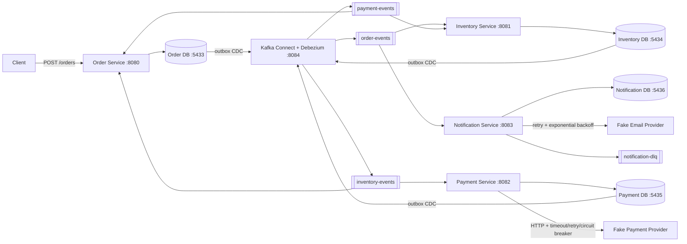
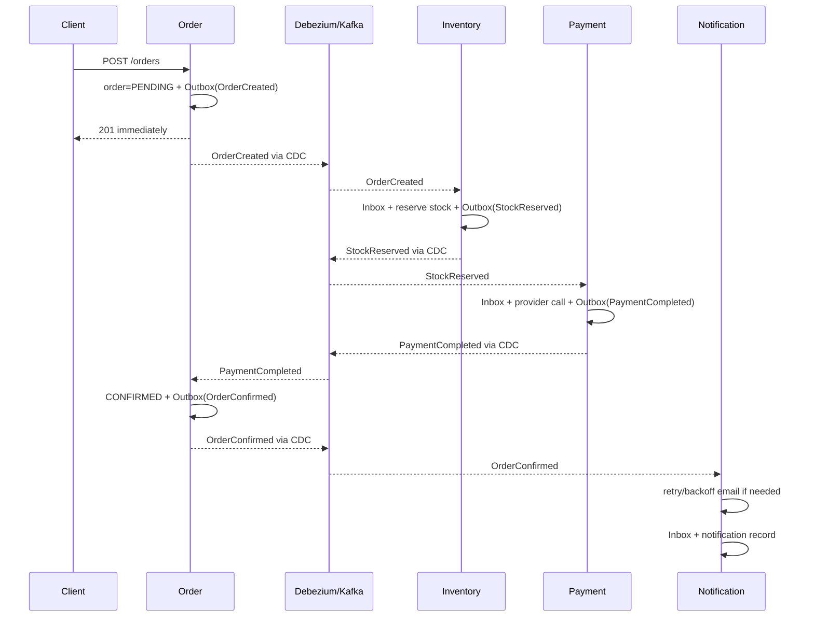
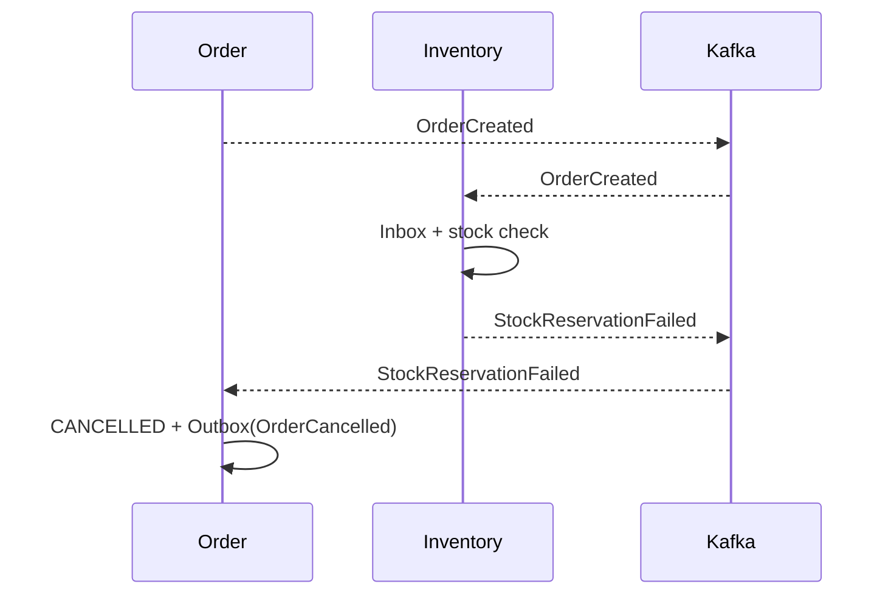
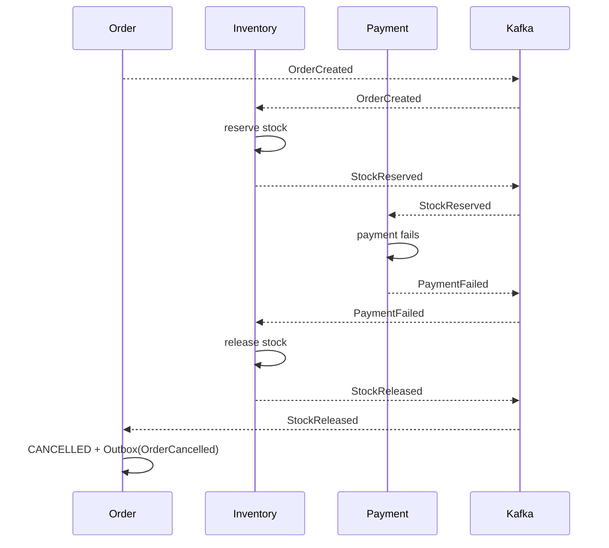

# 08 - Distributed E-commerce with Quarkus

An educational distributed backend that combines several reliability patterns in one small, understandable system.

This is **not** a production e-commerce platform. It is deliberately scoped so the important mechanics are visible in the code and easy to reproduce locally.

## What this project demonstrates

- Transactional Outbox
- Debezium CDC
- Inbox Pattern
- Idempotent Kafka consumers
- Saga choreography
- Compensating transactions
- Eventual consistency
- Retry with exponential backoff
- Dead Letter Queue
- Circuit Breaker
- Correlation IDs
- Cross-service correlation logging
- Service-owned databases

## Stack

- Java 21
- Maven
- Quarkus 3.38.3
- Quarkus REST + Jackson
- Hibernate ORM Panache
- PostgreSQL 18
- Flyway
- Apache Kafka 4.3.1
- Quarkus Messaging Kafka
- Debezium 3.6.1.Final
- SmallRye Fault Tolerance
- Docker Compose
- JUnit / QuarkusTest / RestAssured

## Architecture



The services never query another service's database. The only shared infrastructure is Kafka/Kafka Connect; each service owns its persistence model and migrations.

See [docs/architecture.md](docs/architecture.md) for a deeper walkthrough.

## Service responsibilities

| Service | Port | Database | Responsibilities |
|---|---:|---|---|
| `order-service` | 8080 | `order_db` | Accept orders, own order state, write order outbox events, react to Saga results |
| `inventory-service` | 8081 | `inventory_db` | Idempotently reserve/release stock, own reservations, perform compensation |
| `payment-service` | 8082 | `payment_db` | Idempotently process reserved orders, call fake provider through a circuit breaker, publish payment result |
| `notification-service` | 8083 | `notification_db` | Consume `OrderConfirmed`, retry fake email delivery, publish permanent failures to DLQ |

## Database ownership

There are no cross-service joins and no shared domain tables.

| Database | Owned tables |
|---|---|
| Order | `orders`, `inbox_event`, `outbox_event` |
| Inventory | `inventory_item`, `inventory_reservation`, `inbox_event`, `outbox_event` |
| Payment | `payment`, `inbox_event`, `outbox_event` |
| Notification | `notification`, `inbox_event` |

`outbox_event` exists in services that need an atomic **database state + domain event** change. `inbox_event` exists in stateful event consumers so Kafka redelivery does not repeat the business mutation.

## Kafka topics

| Topic | Producers | Consumers | Purpose |
|---|---|---|---|
| `order-events` | Order outbox via Debezium | Inventory, Notification | Order lifecycle events |
| `inventory-events` | Inventory outbox via Debezium | Payment, Order | Reservation and compensation events |
| `payment-events` | Payment outbox via Debezium | Inventory, Order | Payment result events |
| `notification-dlq` | Notification service | operator / learner | Permanently failed notification events |

## Event envelope

Every event uses the same conceptual envelope:

```json
{
  "eventId": "UUID",
  "correlationId": "UUID",
  "eventType": "OrderCreated",
  "occurredAt": "2026-08-22T18:00:00Z",
  "schemaVersion": 1,
  "payload": {}
}
```

The code uses typed records for event payloads. `JsonNode` is only used at the generic envelope boundary where a consumer does not yet know which event type it received.

See [docs/events.md](docs/events.md) for the full catalogue.

## Successful Saga



## Failed Saga: insufficient inventory



## Failed Saga: payment + compensation



The order is cancelled **after** the inventory compensation completes, which makes the rollback step visible in the event flow.

## Transactional Outbox

The order, inventory, and payment services never perform a database write and a Kafka publish as two unrelated operations.

Instead they do this in one local transaction:

1. update their service-owned business tables;
2. insert a row into `outbox_event` containing the complete event envelope;
3. commit once.

Debezium reads PostgreSQL WAL changes and its Outbox Event Router turns those rows into Kafka messages. If Kafka is temporarily unavailable, the business transaction can still commit; the event remains recoverable from the database/WAL and is published when Kafka recovers.

## Inbox and idempotent consumers

A state-changing Kafka consumer first checks `inbox_event.event_id`.

If the event ID already exists, the consumer logs the duplicate and returns without performing the mutation again. Otherwise the inbox row and business mutation are committed in the same local transaction.

This specifically protects cases such as:

- Kafka redelivery;
- consumer restart before acknowledgement;
- manually replaying the exact same Kafka event.

The inventory tests verify that the same `OrderCreated` reserves stock only once and that the same `PaymentFailed` compensates only once.

## Circuit Breaker

`payment-service` calls the fake payment provider over HTTP through `PaymentProviderGateway`.

The gateway uses:

- `@Timeout`
- `@Retry`
- `@CircuitBreaker`
- `@Fallback`

There are two intentionally different failure types:

- `DECLINE`: provider is reachable and returns a normal rejected payment; this produces `PaymentFailed` but does not represent infrastructure failure.
- `ALWAYS_FAIL` / slow timeout: the call fails technically; repeated failures eventually open the circuit and later calls fail fast through the fallback instead of contacting the provider.

Use `GET /admin/payment-provider/stats` and compare `providerCalls` with `gatewayFallbacks` to observe the open-circuit behavior.

## Notification retry, backoff and DLQ

Notification delivery uses `@Retry(maxRetries = 3)` together with SmallRye `@ExponentialBackoff`.

That means one original attempt plus up to three retries. If all attempts fail, the original Kafka message is not blindly lost. The service emits a `NotificationDeliveryFailed` envelope to `notification-dlq` containing:

- original event;
- error;
- number of attempts;
- failure timestamp.

## Correlation logging

The caller can provide `X-Correlation-ID` to `POST /orders`. If omitted, Order Service creates one.

That correlation ID is copied into every event and put into the logging MDC while each service handles the event.

Expected flow looks like:

```text
[ORDER]        [correlation=abc] OrderCreated
[INVENTORY]    [correlation=abc] StockReserved
[PAYMENT]      [correlation=abc] PaymentFailed
[INVENTORY]    [correlation=abc] StockReleased
[ORDER]        [correlation=abc] OrderCancelled
```

## Prerequisites

- Java 21
- Docker + Docker Compose
- Maven 3.9+
- `curl`
- `jq` is recommended for the demo commands
- `uuidgen` is convenient but optional

## 1. Start infrastructure

```bash
docker compose up -d
```

Check it:

```bash
docker compose ps
./infrastructure/kafka/list-topics.sh
```

## 2. Start the services

Run each in a separate terminal from the repository root:

```bash
mvn -pl order-service quarkus:dev
```

```bash
mvn -pl inventory-service quarkus:dev
```

```bash
mvn -pl payment-service quarkus:dev
```

```bash
mvn -pl notification-service quarkus:dev
```

Flyway creates each service's schema when that service starts.

## 3. Register Debezium outbox connectors

Do this after Order, Inventory and Payment have started at least once so their Flyway-created `outbox_event` tables exist:

```bash
./infrastructure/debezium/register-connectors.sh
```

Verify:

```bash
./infrastructure/debezium/status.sh
```

All connector and task states should be `RUNNING`.

## Demo product

Inventory is seeded with:

```text
productId: 11111111-1111-1111-1111-111111111111
availableQuantity: 10
```

Reset it at any time:

```bash
curl -X PUT http://localhost:8081/admin/inventory/11111111-1111-1111-1111-111111111111/quantity/10 | jq
```

## Happy-path test

Reset providers:

```bash
curl -X PUT http://localhost:8082/admin/payment-provider/reset | jq
curl -X PUT http://localhost:8083/admin/email-provider/reset | jq
```

Create an order:

```bash
CORRELATION_ID=$(uuidgen)
ORDER_RESPONSE=$(curl -s -X POST http://localhost:8080/orders \
  -H 'Content-Type: application/json' \
  -H "X-Correlation-ID: $CORRELATION_ID" \
  -d '{
    "customerEmail": "learner@example.com",
    "productId": "11111111-1111-1111-1111-111111111111",
    "quantity": 2,
    "unitPrice": 25.00
  }')

echo "$ORDER_RESPONSE" | jq
ORDER_ID=$(echo "$ORDER_RESPONSE" | jq -r .id)
```

The POST succeeds immediately with `PENDING`. The later transitions are eventual:

```bash
sleep 3
curl -s http://localhost:8080/orders/$ORDER_ID | jq
curl -s http://localhost:8081/reservations/$ORDER_ID | jq
curl -s http://localhost:8082/payments/order/$ORDER_ID | jq
curl -s http://localhost:8083/notifications/order/$ORDER_ID | jq
```

Expected final result:

```text
order        -> CONFIRMED
reservation  -> RESERVED
payment      -> COMPLETED
notification -> one SENT record
```

Watch events directly if useful:

```bash
./infrastructure/kafka/watch-topic.sh order-events
./infrastructure/kafka/watch-topic.sh inventory-events
./infrastructure/kafka/watch-topic.sh payment-events
```

## Failure experiments

The full command-by-command lab is in [docs/failure-scenarios.md](docs/failure-scenarios.md). The important experiments are summarized below.

### 1. Successful order

Use the happy-path commands above.

Expected: `PENDING -> CONFIRMED`, stock reserved, payment completed, email sent.

### 2. Insufficient inventory

```bash
curl -X PUT http://localhost:8081/admin/inventory/11111111-1111-1111-1111-111111111111/quantity/0 | jq
```

Create a normal order.

Expected events:

```text
OrderCreated -> StockReservationFailed -> OrderCancelled
```

Expected final order: `CANCELLED`.

### 3. Payment failure: business decline

```bash
curl -X PUT http://localhost:8082/admin/payment-provider/reset | jq
curl -X PUT http://localhost:8082/admin/payment-provider/mode/DECLINE | jq
curl -X PUT http://localhost:8081/admin/inventory/11111111-1111-1111-1111-111111111111/quantity/10 | jq
```

Create an order.

Expected events:

```text
OrderCreated -> StockReserved -> PaymentFailed -> StockReleased -> OrderCancelled
```

This is a normal business rejection and should not require the circuit breaker to open.

### 4. Payment provider unavailable / circuit breaker

```bash
curl -X PUT http://localhost:8082/admin/payment-provider/reset | jq
curl -X PUT http://localhost:8082/admin/payment-provider/mode/ALWAYS_FAIL | jq
curl -X PUT http://localhost:8081/admin/inventory/11111111-1111-1111-1111-111111111111/quantity/100 | jq
```

Create several orders quickly, then inspect:

```bash
curl -s http://localhost:8082/admin/payment-provider/stats | jq
```

Expected: after enough technical failures, `gatewayFallbacks` keeps rising while `providerCalls` stops increasing for requests rejected by the open circuit. After the breaker delay, probe calls are allowed again; successful probes can close it.

Reset afterward:

```bash
curl -X PUT http://localhost:8082/admin/payment-provider/reset | jq
```

### 5. Duplicate Kafka event

Capture one existing `OrderCreated` JSON value and send the exact same value again:

```bash
EVENT=$(docker compose exec -T kafka /opt/kafka/bin/kafka-console-consumer.sh \
  --bootstrap-server kafka:29092 \
  --topic order-events \
  --from-beginning \
  --max-messages 1 \
  --timeout-ms 5000 2>/dev/null)

printf '%s\n' "$EVENT" | docker compose exec -T kafka \
  /opt/kafka/bin/kafka-console-producer.sh \
  --bootstrap-server kafka:29092 \
  --topic order-events
```

Expected Inventory log:

```text
Duplicate OrderCreated ignored
```

Stock and reservation counts do not change again.

### 6. Kafka temporarily unavailable

```bash
docker compose stop kafka
```

Now `POST /orders`. The HTTP request and local Order DB transaction still succeed because Order Service writes only to PostgreSQL + its outbox.

The order remains `PENDING` while Kafka is down.

Recover Kafka:

```bash
docker compose start kafka
```

Debezium/Kafka Connect reconnects and the pending outbox event eventually flows through the Saga.

### 7. Notification provider transient failure

```bash
curl -X PUT http://localhost:8083/admin/email-provider/reset | jq
curl -X PUT http://localhost:8083/admin/email-provider/fail-first/2 | jq
```

Create a successful order.

Expected: email succeeds on attempt 3 and the notification row records `attempts: 3`.

### 8. Notification reaches DLQ

```bash
curl -X PUT http://localhost:8083/admin/email-provider/reset | jq
curl -X PUT http://localhost:8083/admin/email-provider/mode/ALWAYS_FAIL | jq
```

Create an otherwise successful order. After four failed delivery attempts:

```bash
docker compose exec -T kafka /opt/kafka/bin/kafka-console-consumer.sh \
  --bootstrap-server kafka:29092 \
  --topic notification-dlq \
  --from-beginning \
  --max-messages 1
```

Expected `eventType`: `NotificationDeliveryFailed` with original event, error, attempts and `failedAt` in the payload.

### 9. Service restart during processing

Use the notification service because its fake provider can deliberately hold a message in flight:

```bash
curl -X PUT http://localhost:8083/admin/email-provider/reset | jq
curl -X PUT http://localhost:8083/admin/email-provider/delay/10000 | jq
curl -X PUT http://localhost:8083/admin/email-provider/mode/SLOW | jq
```

Create a successful order. While Notification Service is sleeping in the provider call, stop that Quarkus process (`Ctrl+C`) and immediately start it again:

```bash
mvn -pl notification-service quarkus:dev
```

Expected: the uncommitted processing is redelivered. Because inbox state is persisted only with successful processing, the message can safely run again rather than being falsely considered complete.

## Run tests

All modules:

```bash
mvn test
```

Important tests intentionally focus on architecture guarantees. Kafka channels use the SmallRye in-memory connector during JVM tests, so these tests do not require a running broker:

- `OrderOutboxIntegrationTest` - creating an order writes the outbox event.
- `InventoryIdempotencyTest` - duplicate event does not double-reserve stock.
- `InventoryCompensationTest` - duplicate payment failure does not double-release stock.
- `PaymentCircuitBreakerTest` - repeated provider failures eventually fail fast.
- `NotificationRetryTest` - transient email failures recover through retry/backoff.
- `NotificationDeadLetterFactoryTest` - DLQ envelopes preserve correlation, attempts and the original event.

## Reset the entire lab

This removes the Kafka and PostgreSQL volumes:

```bash
docker compose down -v
```

Then repeat the startup sequence.

## Directory layout

```text
08-distributed-ecommerce/
├── docker-compose.yml
├── pom.xml
├── README.md
├── docs/
│   ├── architecture.md
│   ├── events.md
│   └── failure-scenarios.md
├── infrastructure/
│   ├── debezium/
│   │   ├── order-outbox.json
│   │   ├── inventory-outbox.json
│   │   ├── payment-outbox.json
│   │   ├── register-connectors.sh
│   │   └── status.sh
│   └── kafka/
│       ├── list-topics.sh
│       └── watch-topic.sh
├── order-service/
├── inventory-service/
├── payment-service/
└── notification-service/
```

## Intentional non-goals

Not included yet:

- Kubernetes
- authentication/authorization
- frontend
- cloud deployment
- API gateway
- service mesh
- schema registry
- tracing backend
- giant shared domain library

The focus is the distributed backend and its failure mechanics.
