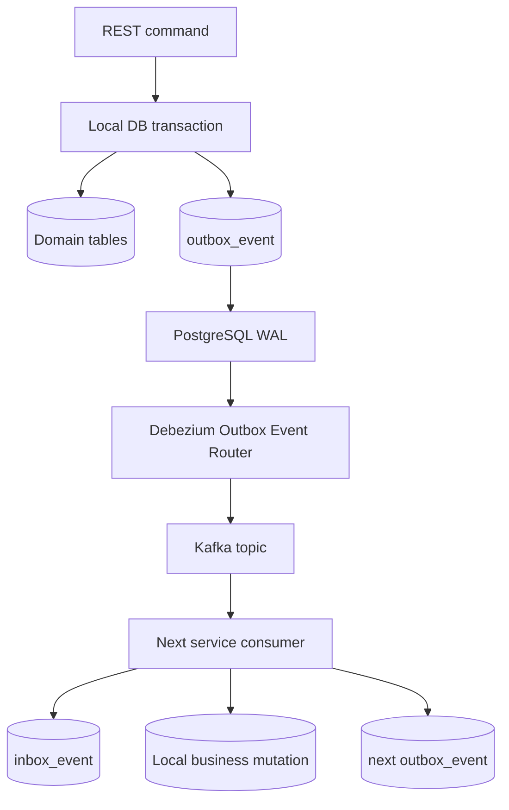

# Architecture

## Goal

This repository is a learning system for seeing distributed architecture patterns interact rather than studying each one in isolation.

The design intentionally prefers explicit service-local code over abstraction-heavy framework layers. Small concepts such as the event envelope are repeated between services so each module can be opened and understood independently.

## Boundaries

Each service owns one PostgreSQL database:

- Order owns orders.
- Inventory owns stock and reservations.
- Payment owns payment results.
- Notification owns successful notification records.

No service imports another service's JPA entities and no service reads another service's tables.

## Data and event path

Business commands enter through REST only at the owning service. State-changing services write domain data and an outbox row in one local transaction. Debezium observes committed outbox inserts and publishes their JSON payload to Kafka.

The consumer's inbox row and business mutation share the same local transaction. A crash before commit leaves neither change committed. A crash after commit may cause Kafka redelivery, but the inbox row then makes that replay a no-op.

## Why the outbox appears in three services

Using the outbox only for the first `OrderCreated` would leave later service transitions with the classic dual-write problem again.

Inventory needs to atomically commit stock reservation and `StockReserved`. Payment needs to atomically commit payment result and `PaymentCompleted` / `PaymentFailed`. Order needs to atomically commit `CONFIRMED` / `CANCELLED` and its corresponding event.

Therefore Order, Inventory and Payment all use the same simple pattern locally. They do not share a domain implementation library.

## Saga choreography

There is no central Saga orchestrator.

Services react to events:

1. Order emits `OrderCreated`.
2. Inventory emits `StockReserved` or `StockReservationFailed`.
3. Payment reacts only to `StockReserved`.
4. Payment emits `PaymentCompleted` or `PaymentFailed`.
5. Inventory reacts to `PaymentFailed` by releasing stock and emits `StockReleased`.
6. Order confirms on `PaymentCompleted` or cancels after `StockReservationFailed` / `StockReleased`.
7. Notification reacts to `OrderConfirmed`.

This makes the system eventually consistent by design.

## Compensation

The important compensating transaction is inventory release after payment failure.

Inventory keeps a reservation record so the compensation does not need information from Payment beyond the order ID. It reloads the reservation, restores quantities, marks that reservation `RELEASED`, and emits `StockReleased` in one transaction.

The same `PaymentFailed` event cannot release inventory twice because its event ID is first protected by Inventory's inbox.

## Payment failure categories

The fake provider separates business and infrastructure failures.

### Business decline

`DECLINE` returns a valid HTTP response with `success=false`.

The payment becomes `FAILED`, but this is not evidence that the network/provider is unhealthy. The circuit breaker therefore sees a normally returned gateway call.

### Technical provider failure

`ALWAYS_FAIL`, configured percentage failures, and slow calls that exceed the gateway timeout throw/timeout. These count as fault-tolerance failures. Repeated failures can open the circuit.

When open, SmallRye Fault Tolerance invokes the fallback without making the provider request. The service then persists a failed payment and emits `PaymentFailed`, keeping the Saga progressing instead of hanging indefinitely.

## Notification failure handling

Email is intentionally not written through a business outbox because it is an external side effect rather than the next domain event in the Saga.

The notification service retries the provider locally with exponential backoff. When the retry policy is exhausted, it publishes a technical failure envelope to `notification-dlq` containing enough context to inspect or replay manually.

## Correlation ID

A correlation ID begins at `POST /orders` and is copied unchanged into every event envelope.

Each event consumer places it in the logging MDC before logging its work. This gives a lightweight distributed observability mechanism without introducing a tracing backend, collector, or service mesh.

## Important limitations

This is educational code, so several production concerns are intentionally not introduced:

- no authentication;
- no API gateway;
- no schema registry;
- no distributed tracing backend;
- no multi-region Kafka/PostgreSQL;
- no Kubernetes;
- no external secrets manager;
- fake providers run inside their owning demo service.

A real payment provider should also provide durable idempotency semantics. The fake provider demonstrates an idempotency key for repeated calls in-process, but it is not a replacement for a real provider contract.
